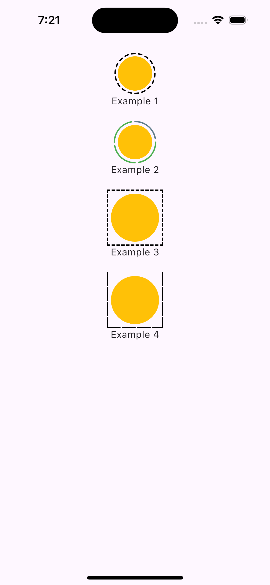

# flutter_dotted_border

A lightweight Flutter package for adding rectangular and circular dotted borders around any widget.
Supports custom dash count, colors, active/inactive segments, and flexible styling.

✨ Features

- Add circular dotted borders with multiple colors (e.g., active vs inactive dashes)
- Add rectangular dotted borders with options to exclude specific sides
- Fully customizable: dash width, gap, stroke, colors, active count, etc.
- Works with any widget and layout
- Lightweight and does not rely on heavy dependencies

📸 Screenshots



🚀 Getting Started

This package is new and still maturing.
Feel free to use it in production, but be aware that APIs may evolve in upcoming versions.

📦 Installation

Add the dependency:

dependencies:
  flutter_dotted_border: ^0.0.1

🧩 Usage

Rectangular Dotted Border
```dart
DottedBorder(
  borderType: RectDottedBorder(
    dashWidth: 5,
  ),
  child: Padding(
    padding: const EdgeInsets.all(5),
    child: Container(
      height: 70,
      width: 70,
      decoration: const BoxDecoration(
        color: Colors.amber,
        shape: BoxShape.circle,
      ),
    ),
  ),
)
```

Circular Dotted Border

```dart
DottedBorder(
  borderType: DottedCircularBorderByNumber(
    numberOfDashes: 20,
    activeCount: 5,
    activeColor: Colors.green,
    inactiveColor: Colors.grey,
  ),
  child: Icon(Icons.check, size: 40),
)
```

📚 Additional Information

Issues & feature requests:
Open an issue on GitHub:
https://github.com/iamashish1/flutter_dotted_border/issues

Contributing:
Contributions are welcome! PRs, bug reports, and suggestions help improve the package.

Roadmap:

- Support rounded rectangular border
- Support gradients
- Support animated dash transitions
- Add more border shapes

❤️ Support the Package

If you find this package useful, please consider starring the repository on GitHub.
